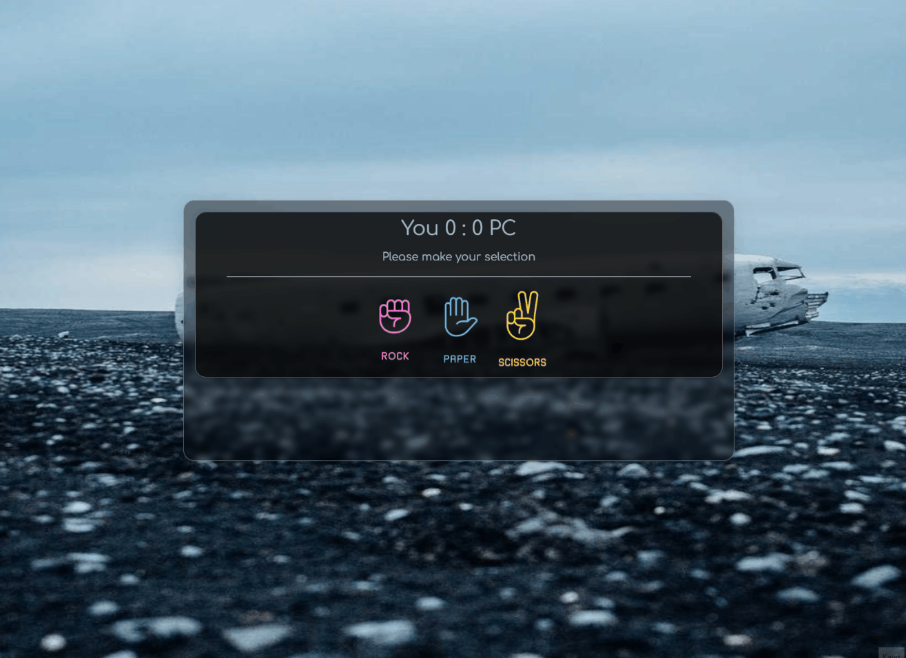

# Rock Paper Scissor Game
---
### GAME TIME!
---
<h3>visit: https://aokmen.github.io/Rock-Paper-Scissor-Game</h3>

---
# Description:

## In this project, a Rock-Paper-Scissors game is implemented using HTML, CSS, and JavaScript. Here is a summary of what has been done:

HTML Structure:

* The game is contained within a <main> element with the class "container".
* The score card section displays the top score, the current scores for the player and the computer, and a description.
* The selection section contains three images representing rock, paper, and scissors for the player to choose from.
* The choice section displays the player's and computer's selections.
* The modal card section is initially hidden and will be shown when the game is over.
---
CSS Styling:

* The project uses CSS variables to define colors and font families.
* The layout is styled with flexbox and various CSS properties to create a visually appealing design.
---
JavaScript Functionality:

* Variables: Various variables are declared to store DOM elements, image elements, and game-related data.
* Event Listeners: The click event is added to the selection section to handle the player's selection.
* User Selection: When the player selects an option, an image representing their choice is displayed.
* Computer Selection: The computer randomly selects an option (rock, paper, or scissors), and an image representing the choice is displayed.
* Result Calculation: The game result is determined by comparing the player's and computer's selections. If it's a draw, the result is displayed accordingly. If the player wins or loses, the score is updated, and the result is displayed.
* Top Score: The top score is stored in the browser's local storage. If the player's score surpasses the top score, it is updated in the local storage.
* Modal Display: When a player reaches a score of 10, the game is over. The modal is displayed, showing the final result (win or loss) and offering a button to play again.
The JavaScript code interacts with the HTML elements, modifies their content and styles, and implements the game logic.
